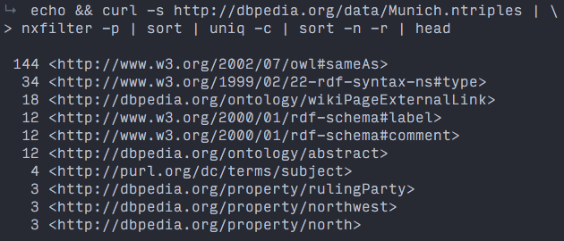
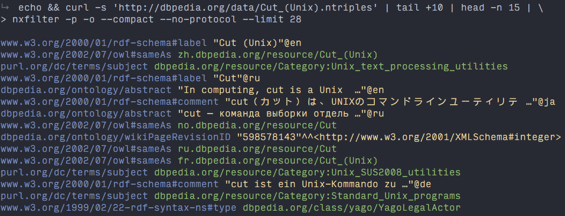

# nxfilter

A command line tool for filtering RDF N-Triples or N-Quads.


## Usage

`nxfilter` lets you:

- Use N-Triples / N-Quads in a Unix pipe to run small ad-hoc queries:

    ```shell
    curl -s http://dbpedia.org/data/Munich.ntriples | \
    nxfilter -p | sort | uniq -c | sort -n -r | head
    ```
    
    

- Look at data files more conveniently in the terminal:

    

Like `cut` for N-x formats, plus some additional query features. 

You can filter by:

- Element position (`-s`, `-p`, `-o`, `-g`)
- Type: `--<element>:<type>` (with types `iri` / `bnode` / `literal`)
- Value: `--<element>=<value>`

Run `nxfilter --help` for [detailed usage information](doc/cli/usage.txt).

[Settings](bin/defaults.json) (colors and defaults) can be adjusted with a dotfile: `~/.nxfilterrc`.


## Examples

Get predicates and objects as TSV:

    nxfilter -p -o --delimiter '\t' data.nt.gz

Get most frequent predicates (pipe):

    cat data.nt | nxfilter -p | sort | uniq -c | sort -n -r | head

Output _(predicate, object)_ tuples where the object is a literal:

    nxfilter --predicate --object:literal data.nt.g